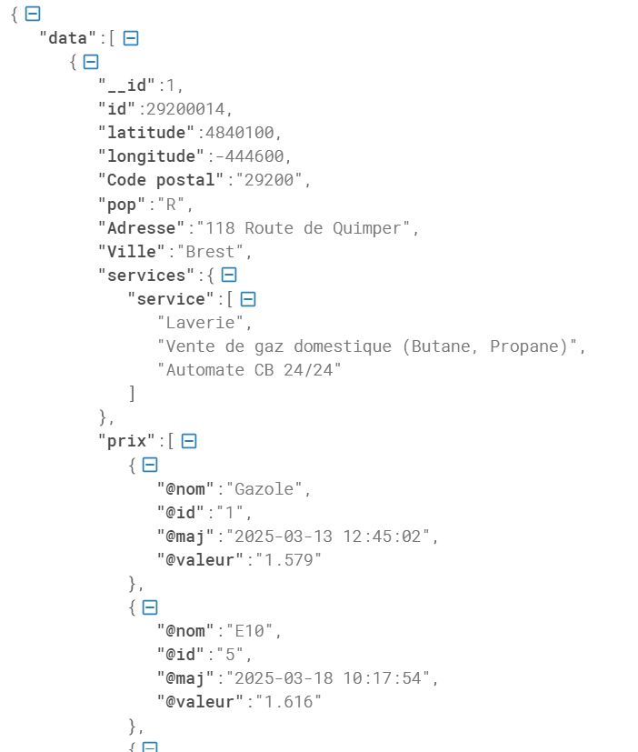
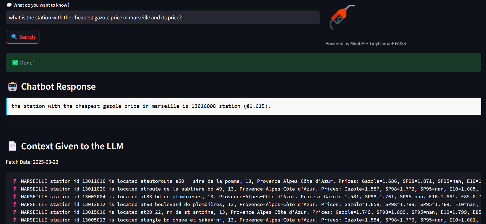
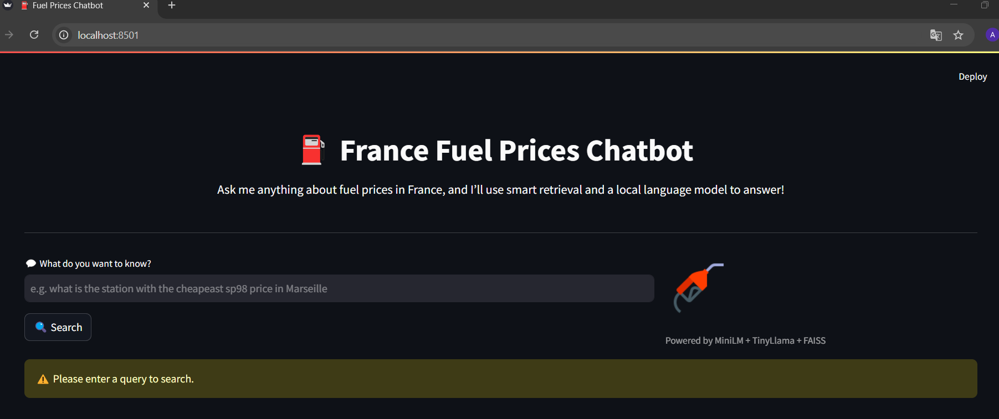

# Fuel Prices France Chatbot

A fully functional end-to-end chatbot and ETL pipeline for tracking and querying fuel prices across France. This project leverages:

- ETL pipeline to collect, clean, and store data
- Semantic search with embeddings (MiniLM + FAISS)
- Retrieval-Augmented Generation (RAG) with a local LLM (TinyLlama)
- Interactive chatbot frontend with Streamlit

---

## Project Structure

```bash
fuel-prices-fr-chatbot/
├── app/                    # Streamlit chatbot UI
│   └── chatbot.py
├── data/                  # Raw, processed, and indexed data
│   ├── raw_data_YYYY-MM-DD.json
│   ├── processed_data_YYYY-MM-DD.csv
│   ├── fuel_prices.db
│   ├── embeddings.pkl
│   └── faiss_index
├── etl/                   # ETL pipeline scripts
│   ├── fetch_data.py
│   ├── transform_data.py
│   ├── load_data.py
│   ├── process_fuel_embeddings.py
│   └── run_etl.py
├── models/                # Local LLM model directory
│   └── tinyllama/
├── utilities/             # Utility scripts
│   └── utils.py
├── download_model.sh      # TinyLlama download script
├── requirements.txt       # Python dependencies
├── fuel_data_processing.log
├── README.md
└── tests/                 # Optional unit tests
```

---

## Setup Instructions

### 1. Clone the Repository
```bash
git clone https://github.com/cartelgouabou/fuel-prices-fr-chatbot.git
cd fuel-prices-fr-chatbot
```

### 2. Create & Activate Virtual Environment
```bash
python -m venv venv-fuel
source venv-fuel/bin/activate  # Windows: venv-fuel\Scripts\activate
```

### 3. Install Python Dependencies
```bash
pip install -r requirements.txt
```

### 4. Download the TinyLlama Model
```bash
chmod +x download_model.sh
./download_model.sh
```

---

## ETL Pipeline: Extract, Transform, Load + Embeddings

Run the entire pipeline with:
```bash
python -m etl.run_etl
```
This runs all ETL steps:

### 1. `fetch_data.py` — Extract
- Fetches paginated JSON fuel station data from [data.gouv.fr](https://www.data.gouv.fr)
- Saves to `data/raw_data_YYYY-MM-DD.json`



### 2. `transform_data.py` — Transform
- Cleans, filters, and normalizes fuel types, location info, and timestamps
- Saves to `data/processed_data_YYYY-MM-DD.csv`

### 3. `load_data.py` — Load
- Loads the processed CSV into SQLite (`fuel_prices.db`)
- Structured schema: stations, fuels, prices, timestamps

### 4. `process_fuel_embeddings.py` — Generate Embeddings
This key RAG step enables semantic search over fuel station data.

- Queries latest prices using SQL:
```sql
SELECT * FROM fuel_prices WHERE updated_at = (SELECT MAX(updated_at) FROM fuel_prices)
```
- Formats station data into descriptive text for embedding
- Uses MiniLM from `sentence-transformers`:
```python
SentenceTransformer("all-MiniLM-L6-v2")
```
- Indexes vectors with FAISS for efficient search
- Outputs:
  - `data/faiss_index`
  - `data/embeddings.pkl` (with original metadata)

### 5. `run_etl.py` — Pipeline Orchestrator
Coordinates the full ETL and embedding workflow with logging.

---

## Chatbot: How It Works

Located at `app/chatbot.py`, this Streamlit app runs an interactive chatbot powered by a local LLM and semantic search.

### End-to-End Flow:

1. **User enters a query**
   > e.g. "Cheapest E10 near Marseille"

2. **Keyword Matching (Location)**
   - Uses `flashtext` to detect regions, departments, or cities

3. **Filtered Semantic Search (FAISS)**
```python
results = find_similar_stations(query, index, metadata_df, embed_model)
```

4. **Prompt Construction**
Combines retrieved station info + user question:
```python
prompt = f"Given the following station data:\n{context}\n\nQuestion: {query}\nAnswer:"
```

5. **Local LLM Generation (TinyLlama)**
```python
response = generate_llm_response(prompt, tokenizer, model)
```

6. **Answer Rendering in Streamlit**
- Chatbot displays the LLM response
- Shows supporting station data (for transparency)



---

## Location Filtering with FlashText
To improve relevance, the app uses `flashtext.KeywordProcessor` to extract location mentions from queries:

```python
@st.cache_resource
def build_location_matchers(df):
    def init_matcher(col):
        matcher = KeywordProcessor()
        for item in df[col].dropna().unique():
            matcher.add_keyword(str(item).lower())
        return matcher

    return (
        init_matcher("city"),
        init_matcher("code_department"),
        init_matcher("region"),
    )
```

> Detected locations are used to filter the FAISS search before querying the LLM.

---

## Run the Chatbot

Start the chatbot interface:
```bash
streamlit run app/chatbot.py
```

You can ask questions like:
> "Where is the cheapest E10 in Marseille?"



---

## Automate Daily ETL

Keep your data fresh using scheduled tasks:

### Linux/macOS (via `cron`)
```bash
crontab -e
```
Add the following line:
```cron
0 3 * * * /path/to/venv-fuel/bin/python /path/to/project/etl/run_etl.py >> /path/to/logs/etl_cron.log 2>&1
```

### Windows (via Task Scheduler)
- Create a new task
- Set daily trigger (e.g. 3AM)
- Action: Start a program
```
Program/script: C:\path\to\venv-fuel\Scripts\python.exe
Add arguments: C:\path\to\fuel-prices-fr-chatbot\etl\run_etl.py
```

---

## Future Improvements

This project provides a solid base for chatbot-driven exploration of structured data. Here are ideas for improving or extending its capabilities:

- Improve prompt templates to guide the LLM for more accurate, structured answers
- Add fuel price graphing and geolocation-based mapping to enhance visualization
- Replace TinyLlama with a more powerful or multilingual model
- Introduce GPU inference support for faster LLM generation
- Add support for map-based search using coordinates or bounding boxes
- Add unit tests and enable CI coverage to ensure pipeline reliability
- Improve LLM reasoning and response formatting
- Build a user feedback interface to gather response quality insights
- Enable PostgreSQL or cloud-based database connectivity
- Adapt the pipeline and chatbot to other domains (legal, healthcare, real estate, etc.)

---

## Features Summary

- Auto-refreshing fuel data pipeline
- Embedding-based semantic search
- Local LLM answering with TinyLlama
- Intelligent geo-filtering (city, department, region)
- Interactive chatbot interface
- Transparent and explainable responses

---

## Contributions & Feedback

Feel free to open issues, contribute improvements, or suggest new features!

---

## License

This project is licensed under the MIT License.

